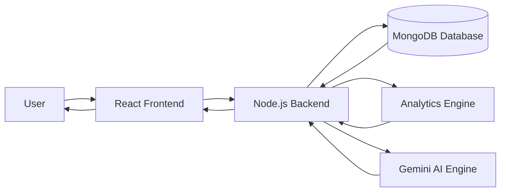
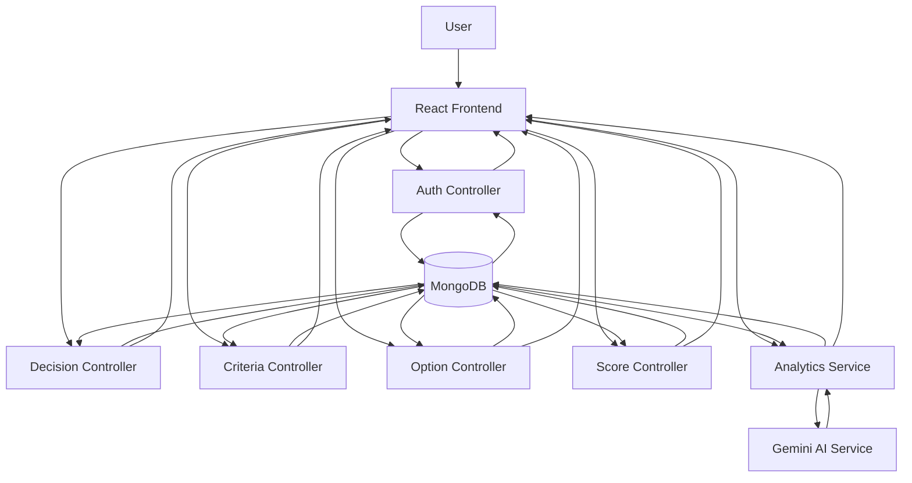
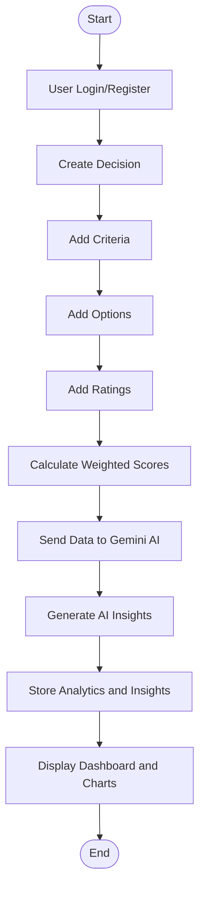
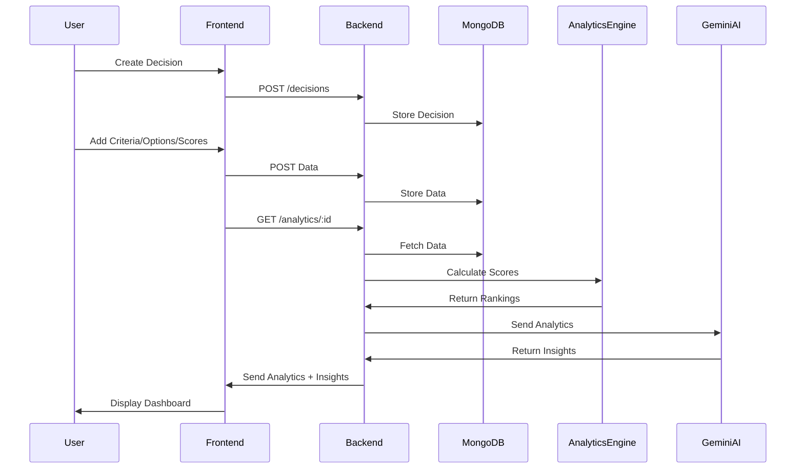
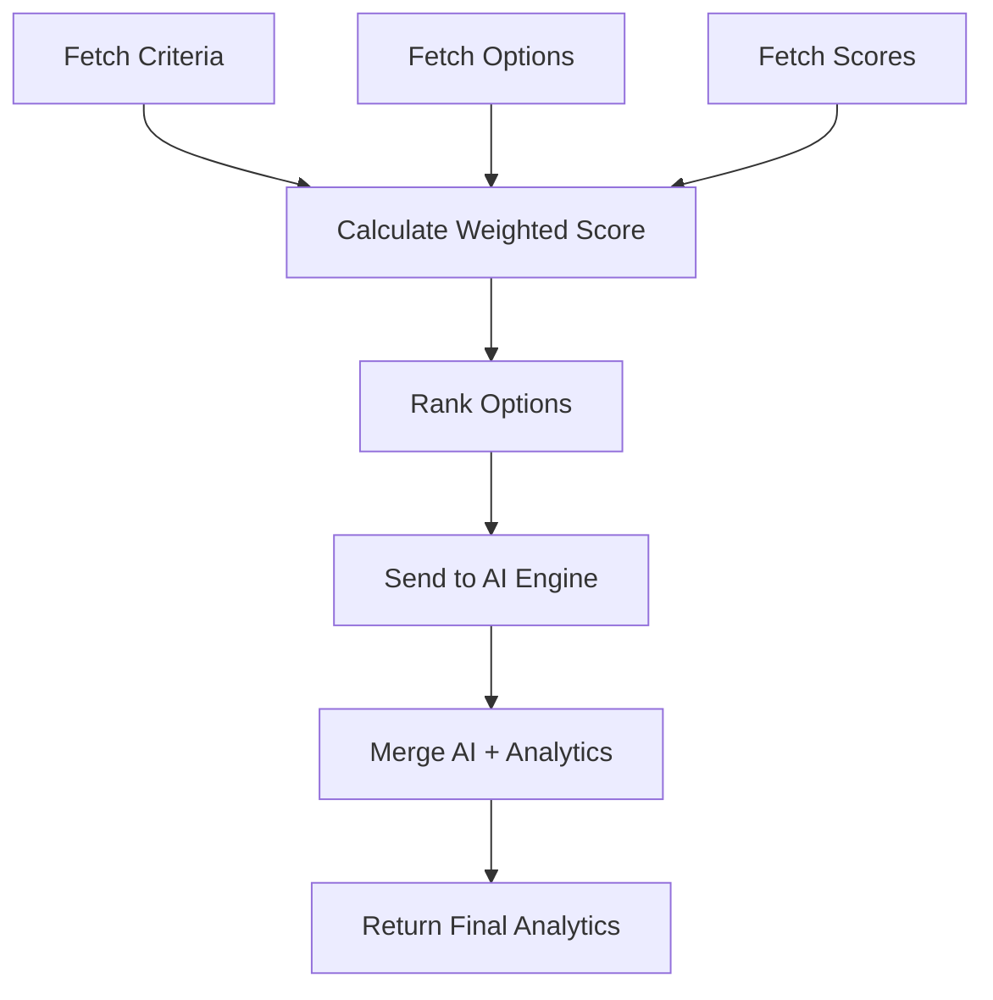
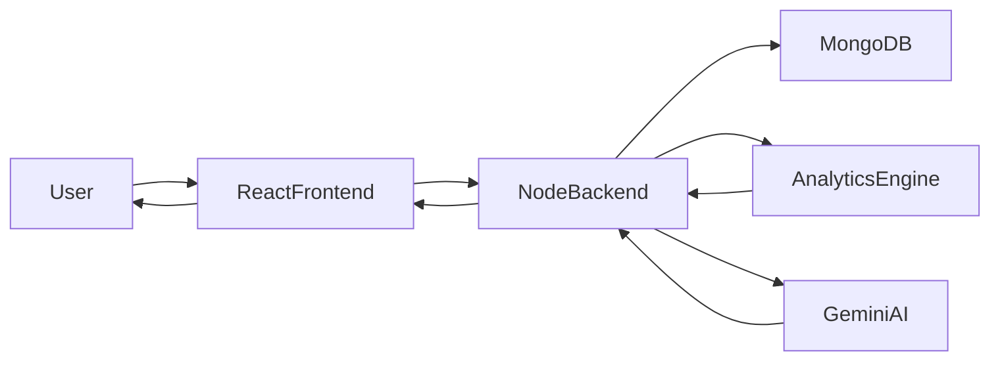

# DecisionIQ – Intelligent Decision Support System

DecisionIQ is an AI-powered decision intelligence platform built using the MERN stack. It helps users make better decisions using weighted scoring, analytics, visualization, and LLM-generated insights.

The system combines deterministic analytics with AI reasoning to provide explainable, data-driven recommendations.

---

# Problem Statement

Users often struggle to make complex decisions involving multiple options and criteria. Traditional approaches rely on intuition rather than structured analysis.

DecisionIQ solves this problem by:

* Structuring decision data
* Applying weighted scoring algorithms
* Generating analytics dashboards
* Using AI to provide intelligent insights and recommendations

---

# Core Architecture Overview

DecisionIQ uses a layered architecture:

1. Data Layer (MongoDB)
2. Backend Layer (Node.js, Express)
3. Analytics Engine (custom scoring logic)
4. AI Layer (Gemini API)
5. Frontend Layer (React)
6. Visualization Layer (Recharts)

Flow:

User → Frontend → Backend → Database → Analytics Engine → AI Engine → Backend → Frontend

---

# Complete Project Flow

## Step 1: User Authentication

User registers and logs in.

Tools used:

* JWT for authentication
* bcrypt for password hashing
* Express middleware for protected routes

Libraries:

* jsonwebtoken
* bcryptjs

Backend routes:
POST /api/auth/register
POST /api/auth/login

---

## Step 2: Decision Creation

User creates a decision.

Example:

Title: Buy Laptop
Description: Select best laptop for programming

Frontend:
React form

Backend:
POST /api/decisions

Database:

Decision Collection:

* _id
* userId
* title
* description
* category
* createdAt

---

## Step 3: Add Criteria

User defines criteria and weights.

Example:

Price (40)
Performance (30)
Battery (30)

Backend:
POST /api/criteria

Database:

Criteria Collection:

* _id
* decisionId
* name
* weight

---

## Step 4: Add Options

User adds options to compare.

Example:

MacBook
Dell XPS

Backend:
POST /api/options

Database:

Option Collection:

* _id
* decisionId
* name
* description

---

## Step 5: Add Ratings (Comparison Data)

User rates each option for each criteria.

Example:

MacBook:
Price: 7
Performance: 9
Battery: 10

Backend:
POST /api/scores

Database:

Score Collection:

* decisionId
* optionId
* criteriaId
* rating

---

## Step 6: Analytics Engine (Core Logic)

Backend calculates weighted score.

Formula:

Total Score = sum(weight × rating)

Example:

MacBook:
(40 × 7) + (30 × 9) + (30 × 10) = 850

Implementation location:

server/services/analyticsService.js

Tools used:

* Native JavaScript
* MongoDB aggregation (optional optimization)

Output:

{
option: MacBook,
score: 850
}

---

## Step 7: AI Insight Engine

Analytics data is sent to LLM (Gemini API).

Purpose:

* Provide recommendation
* Explain reasoning
* Generate insights
* Calculate confidence

Tools used:

* Google Gemini API

Library:
@google/generative-ai

Location:
server/services/aiService.js

Input:

{
decision: Buy Laptop,
analytics: scores,
criteria: weights
}

Output:

{
bestOption: MacBook,
confidence: 87%,
reason: Best performance and battery balance
}

---

## Step 8: Store Analytics and Insights

Backend merges:

* Analytics data
* AI insights

Stored in:

Analytics Collection:

* decisionId
* rankings
* bestOption
* aiInsights
* createdAt

---

## Step 9: Dashboard and Visualization

Frontend displays analytics.

Charts include:

* Bar chart (option scores)
* Pie chart (criteria weights)
* Ranking visualization

Tools used:

* Recharts

Library:
recharts

Location:
client/src/components/charts

---

## Step 10: Activity Tracking

Tracks user actions.

Examples:

* Decision created
* Criteria added
* Decision analyzed

Database:

Activity Collection:

* userId
* decisionId
* action
* timestamp

---

# Complete Tech Stack

Frontend:

* React.js
* Tailwind CSS
* Axios
* Recharts

Backend:

* Node.js
* Express.js

Database:

* MongoDB
* Mongoose

Authentication:

* JWT
* bcryptjs

AI Integration:

* Google Gemini API

Optional:

* Redis (caching)
* Cloudinary (file storage)

---

# Project Folder Structure

DecisionIQ/

client/

* components/
* pages/
* charts/
* services/

server/

* controllers/
* models/
* routes/
* middleware/
* services/
* utils/

---

# Backend Components and Responsibilities

controllers/
Handles API logic

models/
MongoDB schemas

routes/
Defines API endpoints

services/
Contains business logic

analyticsService.js
Scoring engine

aiService.js
LLM integration

middleware/
Authentication validation

---

# Frontend Components and Responsibilities

Pages:
Dashboard
Decision Details
Analytics View

Components:
Decision Form
Charts
Insight Panel

Services:
API communication using Axios

---

# API Flow Example

User requests analytics:

Frontend:
GET /api/analytics/:decisionId

Backend:

Fetch criteria
Fetch options
Fetch scores
Calculate analytics
Send to Gemini
Merge results
Return response

Frontend renders dashboard

---

# Libraries and Tools Summary

Authentication:
jsonwebtoken
bcryptjs

Database:
mongoose

Charts:
recharts

AI:
@google/generative-ai

Frontend:
react
axios

Backend:
express

---

# Key Features

Authentication using JWT
Dynamic decision creation
Weighted scoring engine
Analytics dashboard
AI-powered recommendations
Interactive charts
Activity tracking
Search and filtering

---

# How AI Enhances Analytics

Analytics engine provides numerical scores.

AI provides:

* Explanation
* Confidence score
* Pros and cons
* Recommendation reasoning

This creates explainable decision intelligence.

---

# Deployment Stack

Frontend:
Vercel

Backend:
Render / Railway

Database:
MongoDB Atlas

AI:
Gemini API

---

# Resume Description

Developed DecisionIQ, an AI-powered decision intelligence platform using MERN stack and Gemini API, featuring weighted scoring analytics, real-time dashboards, explainable AI insights, and scalable architecture supporting dynamic multi-criteria decision analysis.

---

# Future Improvements

Collaborative decisions
Decision templates
External data integration
Advanced AI predictions
Real-time updates

---

# Conclusion

DecisionIQ provides structured decision-making using analytics and AI, enabling users to make informed, explainable, and optimized decisions.

This project demonstrates full-stack development, system design, analytics engineering, and AI integration skills.

# Data Flow Diagram (DFD)

## Level 0 – High Level Data Flow

Explanation:

User interacts with frontend → frontend sends data to backend → backend stores and retrieves data from MongoDB → analytics engine calculates scores → AI engine generates insights → backend sends results back to frontend.

---

# Level 1 – Detailed Data Flow Diagram

---

# Complete Workflow Diagram

---

# Component Interaction Diagram

---

# Analytics Engine Internal Flow

---

# Final Architecture Diagram

---

# Where Each Tool is Used

Frontend:
React
Tailwind CSS
Recharts

Backend:
Node.js
Express.js

Database:
MongoDB
Mongoose

Analytics:
Custom analyticsService.js

AI:
Gemini API

Authentication:
JWT
bcrypt

Deployment:
Frontend → Vercel
Backend → Render
Database → MongoDB Atlas

---

These diagrams represent complete system data flow, workflow, and architecture of DecisionIQ.

npm create vite@latest Client -- --template react-js
cd Client
npm install